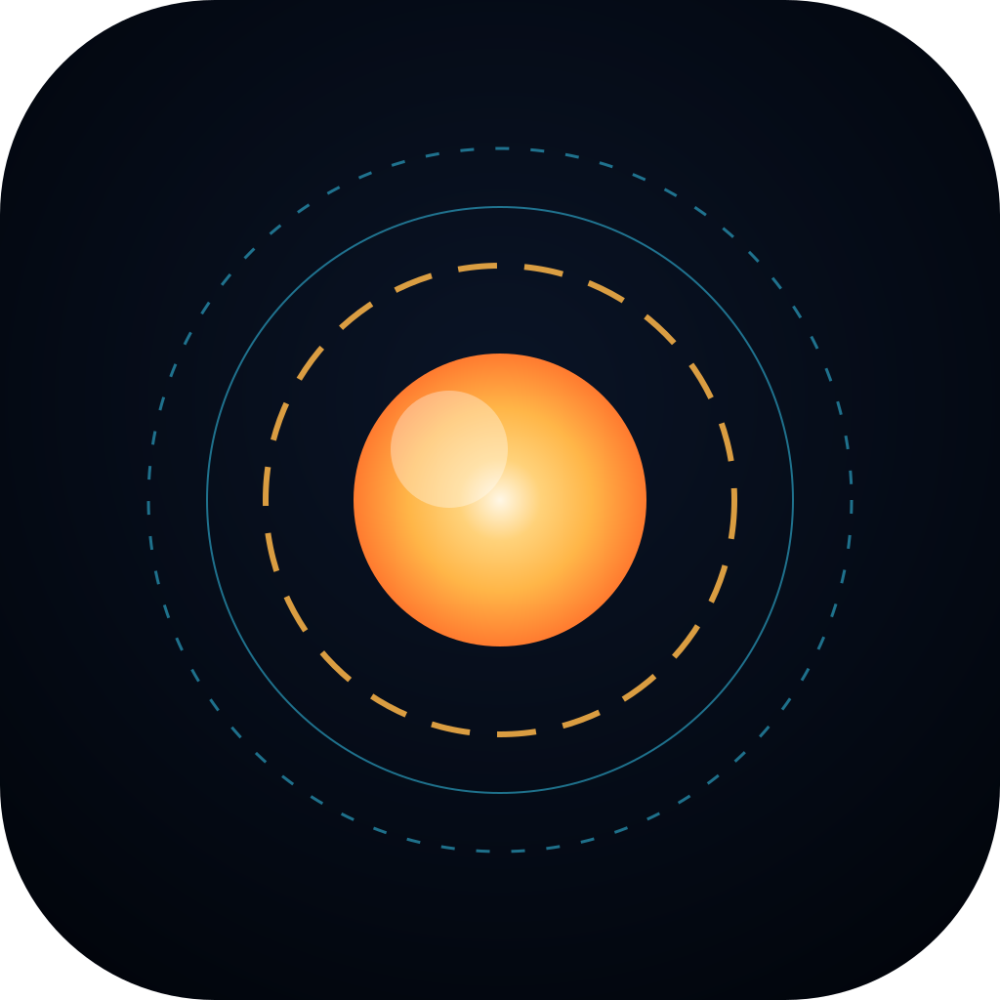

# FRIDAY — a talking, solar-themed to-do assistant for macOS

A glossy sci-fi task HUD modelled on Tony Stark's most advanced suit. Summon it
anywhere on your Mac with a global hotkey, speak (well, type) a directive, and
FRIDAY logs it, colour-classes it by meaning, tracks the deadline, and **speaks
to you out loud** when it's time — in contextual, non-templated lines.



---

## What it does

- **Global hotkey** — press **⇧⌘Space** anywhere to summon the animated quick-add
  HUD (a molten "solar reactor" core, HUD rings, sweep-in animation). Configurable.
- **Natural-language deadlines** — type `Submit invoice tomorrow 5pm`,
  `Call mum friday`, `Gym tonight`, `Pay rent aug 3 9am`, `Review PR in 2 hours`.
  It parses the time, strips it from the title, and shows a live preview.
- **Colour = meaning** (not decoration). Each task is auto-classed, and you can
  override with the pills or **Tab**:

  | Colour | Class | Use it for |
  |---|---|---|
  | 🔴 Red | **Critical** | Mission-critical. Drop everything. |
  | 🟠 Amber | **Deadline** | Hard, unmovable deadlines. |
  | 🔵 Cyan | **Work / Focus** | Deep work, clients, builds. |
  | 🟢 Green | **Personal / Health** | Wellbeing, errands, life. |
  | 🟣 Violet | **Idea / Creative** | Sparks, research, someday. |
  | 🟡 Gold | **Standard** | General directives. |

- **It speaks** — using the macOS speech engine via the Web Speech API. FRIDAY
  composes each line fresh from context (time of day, task class, how close the
  deadline is, your workload) so it never sounds like a canned template:
  - on capture: *"Very good — I have 'submit invoice', that one's tight, today at 5 PM. I'll prompt you in good time."*
  - at deadline: *"Sir, it is time for 'submit invoice'. Hard deadline. Shall I clear the way?"*
  - overdue: *"Circling back — 'submit invoice' is now overdue. I recommend we clear it."*
- **Dashboard command deck** — live clock, stat readouts (active / due today /
  overdue / cleared), the colour legend, filters, and the reactor humming in the
  background. Lives in the **menu bar**; closing the window hides it, it keeps
  running and keeps watching your deadlines.
- **Desktop notifications** fire alongside the voice.

---

## Run it

Requires **Node 18+** and **macOS** (the voice + global hotkey are best there).

```bash
cd friday
npm install
npm start
```

The app launches into the menu bar (look for the small gold reactor icon, top
right). Press **⇧⌘Space** to summon the quick-add HUD.

### First-run tips

- **Give it the FRIDAY voice.** Open **⚙ Settings** → pick a British voice such
  as **Daniel**. If you don't have it: macOS **System Settings → Accessibility →
  Spoken Content → System Voice → Manage Voices** → add *Daniel (English UK)*.
  Leave it on **Auto** and it'll find the best British match itself.
- **Change how it addresses you** (default "Sir") and the **hotkey** in Settings.
- macOS will ask permission for **Notifications** the first time — allow it.

---

## Package as a real `.app` / `.dmg`

```bash
npm run dist     # builds a signed-less .dmg into release/ (arm64 + x64)
# or, faster, an unpackaged .app you can run directly:
npm run pack     # -> release/mac/FRIDAY.app
```

> The `.dmg` is unsigned. On first open, right-click the app → **Open** to get
> past Gatekeeper, or run `xattr -dr com.apple.quarantine release/mac/FRIDAY.app`.
> To ship it widely you'd add an Apple Developer ID in `package.json → build.mac`.

### App icon

`build/icon.svg` holds the reactor mark. electron-builder wants a raster icon —
generate one once and it'll be picked up automatically:

```bash
# any SVG->PNG tool works; e.g. with rsvg-convert or Inkscape:
rsvg-convert -w 1024 -h 1024 build/icon.svg > build/icon.png
```

Without it, packaging still works — you just get the default Electron icon.

---

## How it's built

Plain Electron, no bundler — every screen is hand-written HTML/CSS/Canvas so the
animation stays readable.

```
main.js                 Electron main: windows, global hotkey, tray, IPC, store
preload.js              Secure contextBridge -> window.friday
src/store.js            JSON persistence in the OS user-data dir
renderer/
  index.html            Dashboard command deck
  quickadd.html         The summoned quick-add HUD
  css/                  theme (shared) · dashboard · quickadd
  js/
    reactor.js          The solar-core canvas animation (rings, plasma, flares)
    friday-voice.js     Contextual, anti-repeat speech composer
    colors.js           Colour = meaning taxonomy + keyword inference
    nlp.js              Zero-dependency natural-language deadline parser
    dashboard.js        Rendering, stats, settings + the deadline scheduler
    quickadd.js         Summon animation, live parse preview, commit
```

Two windows share one task file. The **dashboard window stays alive in the
background** and runs the scheduler that fires the spoken "it's time" alerts —
so they reach you even when nothing is on screen.

### Tuning the voice

All the phrasing lives in fragment banks in `renderer/js/friday-voice.js`
(`ACK`, `GREET`, `FLOURISH`, the per-urgency `URGENCY` map, etc.). Add lines to
any bank and the composer folds them into the rotation automatically; an
anti-repeat ring buffer keeps it from saying the same fragment twice in a row.

---

## Notes & limits

- Voices and quality depend on what macOS has installed. The Web Speech API uses
  the system voices directly — no cloud, no API key, works offline.
- Fonts (Orbitron / Rajdhani) load from Google Fonts when online; offline it
  degrades to the system sans stack and still looks right.
- Tasks persist to `~/Library/Application Support/FRIDAY/friday-tasks.json`.
